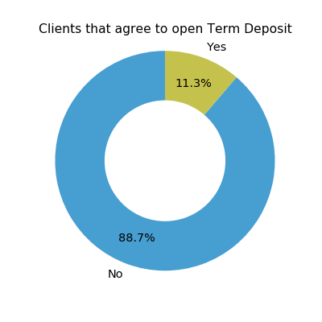
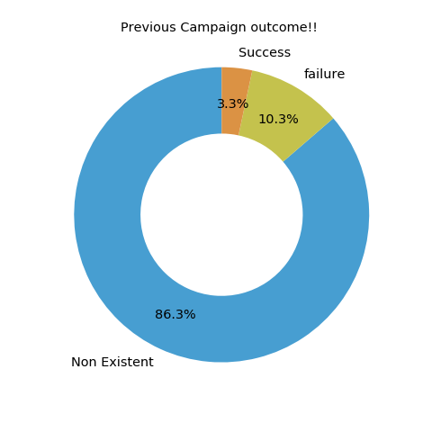
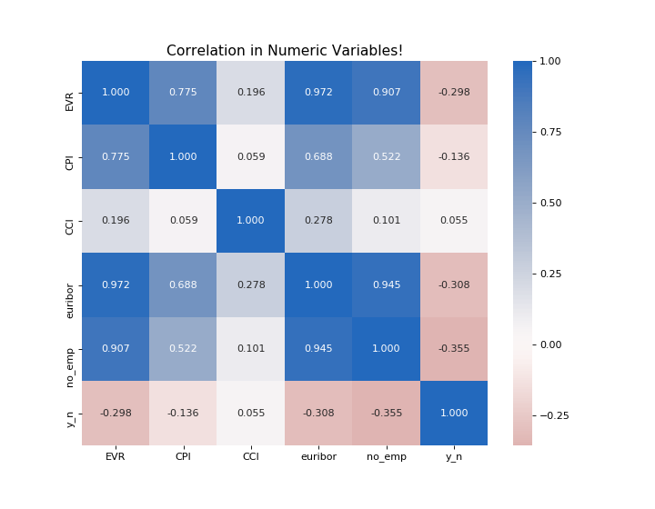
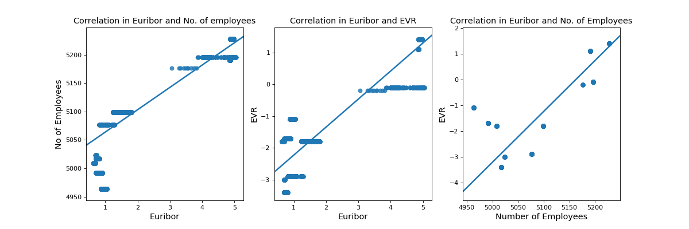
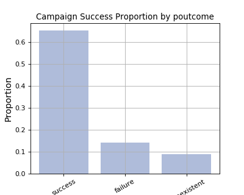
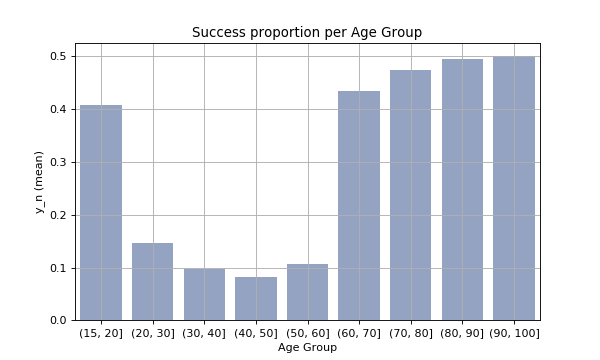
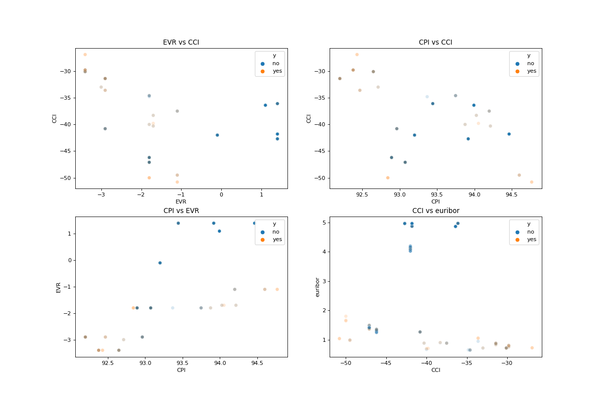
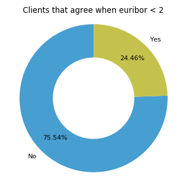
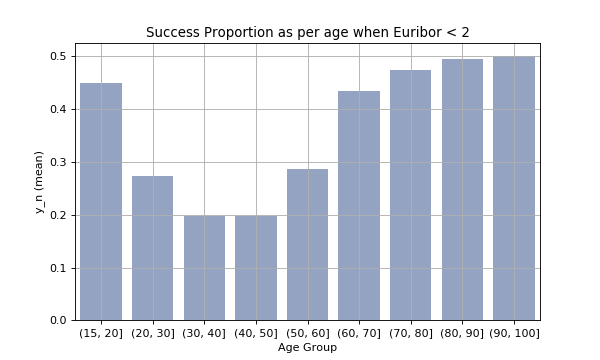

# Bank marketing campaigns analysis
#### by Jyoti K

 

## Approach Undertaken

We majorly explore the data through Univariate, Bivariate and Multivariate data exploration. Statistics has also been used in the process. This is accomplished through Jupyter Notebook and Python libraries such as Pandas, Numpy, Matplotlib and Seaborn.

 

## Dataset

Here we are analyzing [Bank marketing campaigns dataset](https://www.kaggle.com/volodymyrgavrysh/bank-marketing-campaigns-dataset#bank-additional-full.csv) which is publicly available on Kaggle. This dataset describes Portugal bank marketing campaigns results. Conducted campaigns were based mostly on direct phone calls, offering bank client to place a term deposit. If the client says yes to opening the term deposit account, the target variable `'y'` is marked as 'yes', else 'no'.

There are 21 columns and 41176 rows in the dataset. Some of the variables in the dataset has values as 'unknown'. As removing these values could reduce our dataset size and impact our analysis, we will choose to keep the values as is.

Sourse of the data:
https://archive.ics.uci.edu/ml/datasets/bank+marketing

 

## Data Exploration

### Univariate Exploration

We begin by checking what percentage of bank clients agree to open term deposit as per the given data.

Out of the total calls that are made, 11.3 % of them are successful i.e. the client opens the term deposit.

Furthermore, having a look at age distribution tells us that 97.5% of the clients fall in age range of 20 - 60 years old.

Previous campaign outcome is known for 13.6% of the customers. 3.3% of previous outcomes were successful.

Let's also explore correlation in between numeric variables.

- Our variable of interest 'y_n' appears to have some correlation with EVR, euribor and no_emp. We will explore this further in multivariate exploration.
- There also seems to be very strong correlation in between Employment Variation Rate, Euribor and number of employees.

 

### Bivariate Exploration

Let's have a look at the correlation between VR, euribor and no_emp with the help of scatter plot.

It seems conclusive that there is a strong correlation in EVR, euribor and no_emp with each other.
We also noted that when euribor is less than 2, EVR is always less than -1. Similarly, when euribor is more than 3, EVR is always more than 0.5.

Next, we will go through some category variables to check if there is any trend in proportion of clients that say 'yes'.

Approximately 32% of students and 25% of retirees say 'yes' to open deposit account with the bank.

65% of the people who agreed for previous campaign agreed for this campaign as well. That is a very significant number and certainly could be used by sales team to select target customers.

This is an interesting trend. Although 97.5% of clients fall in age range of 20-60, they are the ones who are least likely to open the account. Success rate for the calls is more for clients upto 20 and above 60 years of age.

 

### Multivariate Exploration

Let's start by gauging how EVR, CCI, CPI and euribor affect our variable of interest 'y_n'.

There appears to be some trend when euribor is less than 2. We will investigate this further. 

Let's begin with selecting records where Euribor is less than 2 and perform further analysis on this sample data.

- **When EVR < -1 and euribor < 2, 24.46% of people agree to opening term deposit. This is more than double of success rate in whole dataset.**
- **Number of calls placed when euribor is less than 2 (13494), are half of those place when euribor is 2 or more (27682). This is a very significant difference in numbers and highlights an area where we can work upon to get more positive results.**

Further, Let's check Success Proportion as per age when Euribor < 2.

- **When we compare this trend with overall data trend, there are some considerable changes. We see that clients upto 60 years of age, open considerably higher percentage of term deposits when euribor 3 month rate is less than 2. However, clients with more than 60 years of age, follow almost the same trend as in overall data.**
- **22.93% of young people(upto age 60) open term deposit when euribor < 2. This is more than the average of 10.49% over the whole dataset.**

 

## Summary of Findings

> - We noticed that when euribor 3 month rate is less than 2, success rate of the campaign increases to 24.46%. This is significant increase from 11.3% success rate in overall data.
> - Number of calls placed when euribor is less than 2 are half of those place when euribor is 2 or more. This is a very significant difference in numbers and highlights an area where we can work upon to get more positive results.
> - Statistically, 22.93% of young people(upto age 60) open term deposits when euribor < 2. This is more than the average of 10.49% over the whole dataset for the same age group. Therefore, we can conclude that clients upto 60 years of age open considerably higher percentage of accounts when euribor 3 month rate is less than 2. However, clients with more than 60 years of age, follow almost the same trend as in overall data.

 

## Key Insights for Presentation

> - We observed that when euribor 3 month rate is less than 2, clients under the age of 60 are twice more likely to open a term deposit. We should noticed that bank called only half the number of customers when euribor was less than 2 as compared to otherwise. So, we should target to call more customers during this period for better success rate.
> - In overall data, students and retirees are much more likely to open term deposit. 45% of clients above 60 years of age agreed to open term deposit. But we have only 2.5% of customers in this range. It is recommended to include more of students, retirees and clients older than 60 years of age to get a better success rate in overall dataset.
> - Clients for whom previous campaign outcome was successful, agreed to 65% of the calls. This is significant figure and can be used to target customers in further campaigns.

 

## Pre-requsites:

- Jupyter Notebook
- Python 3.7
    - Pandas
    - Numpy
    - Matplotlib
    - Seaborn
